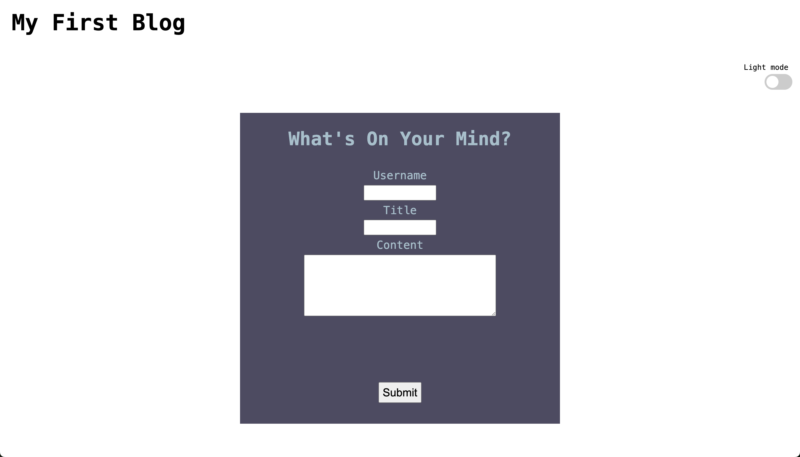
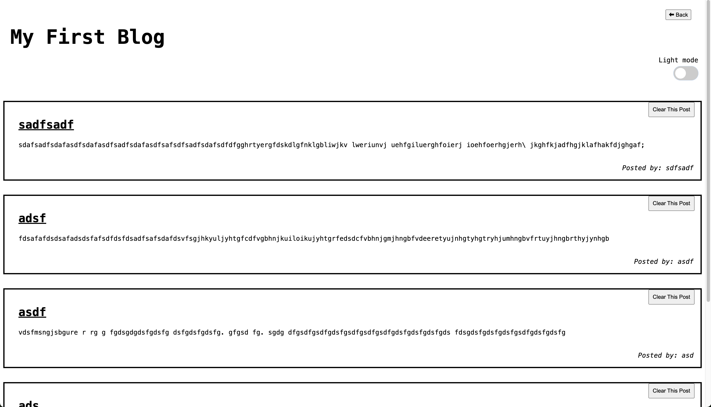

# My-First-Blog

This repository is a website that allows users to log and display blog content. At the moment the content is only limited to text. The content is stored in local storage and can be removed if need be.

Here is the link to the website: 

All inputs must be filled in the form page for the user to access the blog display page.

Here are some images of the website

